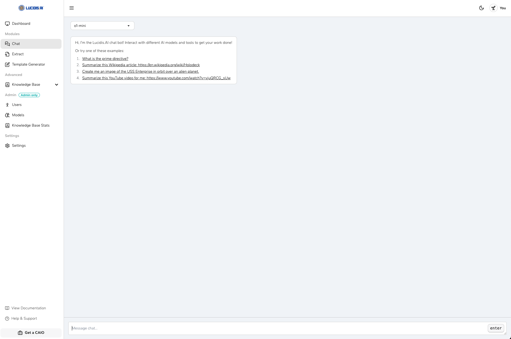

In this guide, you will learn how to chat with multiple AI models and leverage your knowledge base for enhanced interactions.

## Chatting with Multiple Models

Lucidis allows you to interact with various AI models, enabling you to choose the best one for your specific needs. Here’s how to get started:

1. **Select a Model**: Choose from the available AI models based on your requirements. Each model may have different strengths and capabilities.

2. **Initiate a Chat**: Start a conversation by sending a message to the selected model. You can ask questions, request information, or seek assistance with tasks.

3. **Receive Responses**: The model will process your input and provide a response. You can continue the conversation by asking follow-up questions or clarifying your requests.

## Using Your Knowledge Base as Context

To enhance the quality of responses, you can provide context from your knowledge base during the chat. Here’s how:

1. **Integrate Knowledge Base**: Ensure that your knowledge base is set up and contains relevant information that can assist in the conversation.

2. **Reference Knowledge Base**: When initiating a chat, mention specific topics or items from your knowledge base. This helps the model understand the context and provide more accurate responses.

3. **Example Interaction**: 
   - User: "Can you provide details about the work order process?"
   - Model: "Sure! The work order process involves several steps, including ingestion, extraction, and preparation of documents."

---

By following these steps, you can effectively chat with multiple AI models and utilize your knowledge base to enhance your interactions.

